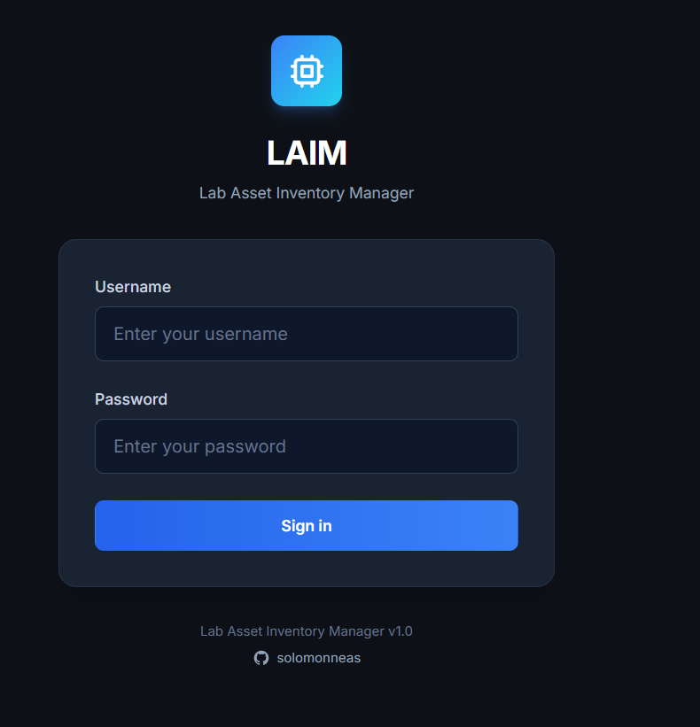

# LAIM - Lab Asset Inventory Manager

A modern hardware inventory management system built for lab environments. Features real-time search, category filtering, and a sleek UI.




## Features

- **7 Hardware Categories**: Laptops, Desktops, Smart TVs, Servers, WAPs, Routers, and Switches
- **Real-time Search**: Instant filtering across hostnames, serials, MACs, and asset tags
- **RBAC**: Role-based access control with superuser and admin accounts
- **Sleek UI**: Clean design with Geist/Inter fonts and tabular numbers
- **Docker-based**: Fully containerized FastAPI + PostgreSQL stack
- **Proxmox Ready**: Automated LXC container deployment on Proxmox VE
- **API Sync Integration**: Auto-discover devices from Netdisco and LibreNMS

## Architecture Overview

LAIM is a full-stack web application with a clear separation between frontend and backend components.

### How It Works

```
+-----------------------------------------------------------------------+
|                            User Browser                               |
|  +----------------------------------------------------------------+   |
|  |                     Frontend (Templates)                       |   |
|  |  - Jinja2 HTML templates rendered server-side                  |   |
|  |  - Tailwind CSS for styling                                    |   |
|  |  - Vanilla JavaScript for interactivity (search, modals)       |   |
|  +----------------------------------------------------------------+   |
+-----------------------------------------------------------------------+
                                    |
                                    | HTTP Requests
                                    v
+-----------------------------------------------------------------------+
|                          FastAPI Backend                              |
|  +----------------------------------------------------------------+   |
|  |                       main.py (Routes)                         |   |
|  |  - HTML routes (/, /login) - render templates                  |   |
|  |  - API routes (/api/*) - return JSON                           |   |
|  |  - Authentication middleware (JWT in cookies)                  |   |
|  +----------------------------------------------------------------+   |
|                                   |                                   |
|  +------------------+  +------------------+  +------------------+     |
|  |    auth.py       |  |   schemas.py     |  |  scheduler.py    |     |
|  |  - JWT tokens    |  | - Pydantic models|  |  - APScheduler   |     |
|  |  - Password hash |  | - Validation     |  |  - Background    |     |
|  +------------------+  +------------------+  +------------------+     |
|                                   |                                   |
|  +----------------------------------------------------------------+   |
|  |                       integrations/                            |   |
|  |  - NetdiscoClient: fetches devices from Netdisco API           |   |
|  |  - LibreNMSClient: fetches devices from LibreNMS API           |   |
|  |  - DeviceSyncService: merges, dedupes, upserts devices         |   |
|  +----------------------------------------------------------------+   |
+-----------------------------------------------------------------------+
                                    |
                                    | SQLAlchemy ORM
                                    v
+-----------------------------------------------------------------------+
|                         PostgreSQL Database                           |
|  +------------------+  +------------------+  +------------------+     |
|  |      users       |  | inventory_items  |  |    sync_logs     |     |
|  |  - username      |  |  - hostname      |  |  - started_at    |     |
|  |  - password      |  |  - serial_num    |  |  - status        |     |
|  |  - role          |  |  - item_type     |  |  - created       |     |
|  +------------------+  |  - source        |  |  - updated       |     |
|                        +------------------+  +------------------+     |
+-----------------------------------------------------------------------+
```

### Frontend

The frontend uses **server-side rendering** with Jinja2 templates:

- **`templates/base.html`** - Base layout with navigation, CSS imports, and common scripts
- **`templates/login.html`** - Login form with credential validation
- **`templates/dashboard.html`** - Main inventory view with search, filters, and data table

**Key frontend features:**
- Real-time search filtering via JavaScript (no page reload)
- Modal dialogs for add/edit operations
- Category filter chips for quick filtering
- Responsive design with Tailwind CSS

### Backend

The backend is built with **FastAPI** (async Python web framework):

- **`app/main.py`** - Route definitions, request handling, template rendering
- **`app/models.py`** - SQLAlchemy ORM models (User, InventoryItem, SyncLog)
- **`app/schemas.py`** - Pydantic schemas for request/response validation
- **`app/auth.py`** - JWT token creation, password hashing, authentication middleware
- **`app/database.py`** - Database connection pooling and session management

**Request flow:**
1. User submits request (e.g., `GET /api/items?search=laptop`)
2. FastAPI routes request to handler function
3. Handler validates input with Pydantic schemas
4. SQLAlchemy queries PostgreSQL database
5. Results serialized and returned as JSON (or rendered as HTML)

### External Integrations

The sync system connects to network monitoring tools:

- **`app/integrations/base.py`** - Base HTTP client with retry logic and rate limiting
- **`app/integrations/netdisco.py`** - Netdisco API client (device discovery)
- **`app/integrations/librenms.py`** - LibreNMS API client (device monitoring)
- **`app/integrations/sync.py`** - Orchestrates fetching, merging, and database updates

**Sync flow:**
1. Scheduler triggers sync (or manual API call)
2. Clients fetch device lists from external APIs
3. Devices merged (LibreNMS takes priority on conflicts)
4. Deduplication by serial number or MAC address
5. Existing records updated, new records created
6. Results logged to sync_logs table

## Tech Stack

- **Backend**: FastAPI, SQLAlchemy, PostgreSQL 16
- **Frontend**: Jinja2, Tailwind CSS, Vanilla JavaScript
- **Infrastructure**: Docker Compose, Debian 13 LXC
- **Integrations**: Netdisco API, LibreNMS API, APScheduler
- **Fonts**: Geist Sans (headers), Inter (body), Geist Mono (technical data)

## Quick Start

### Option 1: Proxmox LXC Deployment (Recommended)

1. **On Proxmox host**, create the container:
```bash
chmod +x proxmox_lxc_create.sh
./proxmox_lxc_create.sh
```

2. **Copy files to container**:
```bash
pct push 200 /path/to/laim /opt/laim -r
```

3. **Enter container and deploy**:
```bash
pct enter 200
cd /opt/laim
chmod +x setup.sh
./setup.sh
```

4. **Access the application**:
```
http://<container-ip>:8000
```

### Option 2: Local Docker Deployment

1. **Clone the repository**:
```bash
git clone <your-repo-url>
cd inventory
```

2. **Create environment file**:
```bash
cp .env.example .env
# Edit .env with your credentials
```

3. **Start the application**:
```bash
docker compose up -d
```

4. **Seed the database**:
```bash
docker compose exec web python -m app.seed --with-samples
```

5. **Access the application**:
```
http://localhost:8000
```

## Upgrading Existing Installation

If you're upgrading from a previous version of LAIM, follow these steps to avoid database conflicts:

### For LXC Container Deployments

```bash
# 1. Enter the container
pct enter 200

# 2. Navigate to application directory
cd /opt/laim

# 3. Stop the application
docker compose down

# 4. Pull latest code
git pull origin main

# 5. Rebuild containers (picks up new dependencies)
docker compose build --no-cache

# 6. Start the application
docker compose up -d

# 7. Run database migrations (IMPORTANT)
docker compose exec web alembic upgrade head

# 8. Verify everything is working
docker compose logs -f web
curl http://localhost:8000/health
```

### For Local Docker Deployments

```bash
# 1. Navigate to application directory
cd /path/to/laim

# 2. Stop the application
docker compose down

# 3. Pull latest code
git pull origin main

# 4. Rebuild containers
docker compose build --no-cache

# 5. Start the application
docker compose up -d

# 6. Run database migrations
docker compose exec web alembic upgrade head

# 7. Verify
docker compose logs -f web
```

### Important Notes

- **Always stop the application** before pulling updates
- **Run migrations after rebuilding** to ensure database schema is updated
- Fresh installations don't need migrations - SQLAlchemy creates everything automatically
- If you encounter migration errors, check the Troubleshooting section below

## Default Credentials

| Username | Password | Role |
|----------|----------|------|
| superadmin | SuperAdmin123! | Superuser |
| admin1 | Admin123! | Admin |
| admin2 | Admin123! | Admin |
| admin3 | Admin123! | Admin |

**Warning**: Change these passwords in production!

## Netdisco & LibreNMS Integration

LAIM can automatically discover and sync devices from [Netdisco](https://netdisco.org/) and [LibreNMS](https://www.librenms.org/) network monitoring systems.

### Setup

1. **Run the database migration** (if upgrading from a previous version):
```bash
docker compose exec web alembic upgrade head
```

2. **Configure API credentials** in your `.env` file:
```bash
# Netdisco API
NETDISCO_API_URL=https://netdisco.yournetwork.local
NETDISCO_USERNAME=api_user
NETDISCO_PASSWORD=your_password

# LibreNMS API
LIBRENMS_API_URL=https://librenms.yournetwork.local
LIBRENMS_API_TOKEN=your_api_token

# Sync Settings
SYNC_ENABLED=true
SYNC_INTERVAL_HOURS=6
SYNC_RATE_LIMIT=10
```

### Obtaining API Credentials

#### Netdisco
1. Log into your Netdisco web interface
2. Go to **Admin** > **User Management**
3. Create a dedicated API user or use existing credentials
4. The API uses the same username/password as web login

#### LibreNMS
1. Log into your LibreNMS web interface
2. Go to **Settings** (gear icon) > **API** > **API Settings**
3. Click **Create API Token**
4. Copy the generated token to your `.env` file

### Triggering a Sync

**Manual sync** (via API):
```bash
# Sync from all sources
curl -X POST http://localhost:8000/api/sync/trigger \
  -H "Cookie: access_token=<your_token>" \
  -H "Content-Type: application/json" \
  -d '{"source": "all"}'

# Sync from Netdisco only
curl -X POST http://localhost:8000/api/sync/trigger \
  -H "Content-Type: application/json" \
  -d '{"source": "netdisco"}'

# Sync from LibreNMS only
curl -X POST http://localhost:8000/api/sync/trigger \
  -H "Content-Type: application/json" \
  -d '{"source": "librenms"}'
```

**Scheduled sync**: When `SYNC_ENABLED=true`, the application automatically syncs every `SYNC_INTERVAL_HOURS` hours (default: 6).

### How Sync Works

1. **Fetches devices** from configured sources (Netdisco and/or LibreNMS)
2. **Merges data** - LibreNMS takes priority when the same device exists in both systems
3. **Deduplicates** by serial number or MAC address
4. **Auto-detects device type** based on model/vendor strings (Router, Switch, WAP, Server, etc.)
5. **Upserts to inventory** - updates existing items or creates new ones
6. **Logs results** to sync history for auditing

### Sync Data Mapping

| LAIM Field | Netdisco Source | LibreNMS Source |
|------------|-----------------|-----------------|
| hostname | dns | hostname/sysName |
| serial_number | serial | serial |
| mac_address | nodes[0].mac | ports[0].ifPhysAddress |
| ip_address | ip | ip |
| model | model | hardware |
| vendor | vendor | (parsed from hardware) |
| firmware_version | os_ver | version |

## Data Model

Each inventory item includes:
- **Hostname**: Device hostname (e.g., LAB-LAPTOP-001)
- **Serial Number**: Manufacturer serial number
- **MAC Address**: Network MAC address (optional)
- **Asset Tag**: Internal asset tracking number
- **Item Type**: Laptop, Desktop, Smart TV, Server, WAP, Router, or Switch
- **Room Location**: 2265 or 2266
- **Sub-location**: Rack, shelf, or desk identifier
- **Notes**: Additional information
- **Source**: Origin of the record (manual, netdisco, librenms, merged)
- **IP Address**: Device IP (from sync)
- **Model/Vendor**: Hardware details (from sync)
- **Firmware Version**: OS/firmware version (from sync)

## API Endpoints

### Authentication
- `POST /api/login` - Get access token
- `GET /logout` - Logout and clear session

### Inventory Items
- `GET /api/items` - List items (supports search, type, and room filters)
- `GET /api/items/{id}` - Get specific item
- `POST /api/items` - Create new item (admin+)
- `PUT /api/items/{id}` - Update item (admin+)
- `DELETE /api/items/{id}` - Soft delete item (admin+)

### Device Sync
- `POST /api/sync/trigger` - Trigger manual sync (admin+)
- `GET /api/sync/status/{id}` - Get sync job status
- `GET /api/sync/history` - View sync history

### User Management (Superuser only)
- `GET /api/users` - List users
- `POST /api/users` - Create user
- `PUT /api/users/{id}` - Update user

### Statistics
- `GET /api/stats` - Get dashboard statistics

## Environment Variables

| Variable | Description | Default |
|----------|-------------|---------|
| `POSTGRES_USER` | Database username | laim |
| `POSTGRES_PASSWORD` | Database password | (generated) |
| `POSTGRES_DB` | Database name | laim |
| `APP_PORT` | Application port | 8000 |
| `SECRET_KEY` | JWT secret key | (generated) |
| `SUPERUSER_USERNAME` | Initial superuser username | superadmin |
| `SUPERUSER_PASSWORD` | Initial superuser password | SuperAdmin123! |
| `NETDISCO_API_URL` | Netdisco server URL | (none) |
| `NETDISCO_USERNAME` | Netdisco API username | (none) |
| `NETDISCO_PASSWORD` | Netdisco API password | (none) |
| `LIBRENMS_API_URL` | LibreNMS server URL | (none) |
| `LIBRENMS_API_TOKEN` | LibreNMS API token | (none) |
| `SYNC_ENABLED` | Enable scheduled sync | true |
| `SYNC_INTERVAL_HOURS` | Hours between syncs | 6 |
| `SYNC_RATE_LIMIT` | API requests per second | 10 |

## Project Structure

```
inventory/
├── proxmox_lxc_create.sh    # Proxmox LXC creation script
├── docker-compose.yml       # Docker orchestration
├── Dockerfile               # Application container
├── requirements.txt         # Python dependencies
├── setup.sh                 # Container setup script
├── alembic/                 # Database migrations
│   └── versions/            # Migration scripts
├── app/
│   ├── main.py              # FastAPI routes and request handlers
│   ├── models.py            # SQLAlchemy ORM models
│   ├── schemas.py           # Pydantic validation schemas
│   ├── database.py          # Database connection management
│   ├── auth.py              # JWT authentication utilities
│   ├── seed.py              # Database seeding script
│   ├── scheduler.py         # APScheduler background jobs
│   └── integrations/        # External API clients
│       ├── base.py          # Base HTTP client with retry logic
│       ├── netdisco.py      # Netdisco API client
│       ├── librenms.py      # LibreNMS API client
│       └── sync.py          # Device sync orchestration
├── templates/
│   ├── base.html            # Base layout template
│   ├── login.html           # Login page
│   └── dashboard.html       # Main inventory dashboard
├── static/                  # CSS, JavaScript, images
└── docs/
    └── login-screenshot.png # UI screenshot
```

## Development

### Running Tests
```bash
docker compose exec web pytest
```

### View Logs
```bash
docker compose logs -f web
```

### Database Shell
```bash
docker compose exec db psql -U laim -d laim
```

### Application Shell
```bash
docker compose exec web python
```

### Run Database Migration
```bash
docker compose exec web alembic upgrade head
```

## Useful Commands

### Docker Compose
```bash
# Stop services
docker compose down

# Restart services
docker compose restart

# Rebuild images
docker compose build --no-cache

# View service status
docker compose ps
```

### Proxmox LXC
```bash
# Start container
pct start 200

# Stop container
pct stop 200

# Enter container
pct enter 200

# View container config
pct config 200
```

## Troubleshooting

### Migration Issues

**"type 'syncstatus' already exists" or "column does not exist" errors:**

This happens when the app started before migrations ran. To fix:

```bash
# Connect to database
docker compose exec db psql -U laim -d laim

# Add missing columns manually
ALTER TABLE inventory_items ADD COLUMN IF NOT EXISTS source VARCHAR(50);
ALTER TABLE inventory_items ADD COLUMN IF NOT EXISTS source_id VARCHAR(255);
ALTER TABLE inventory_items ADD COLUMN IF NOT EXISTS last_synced_at TIMESTAMP WITH TIME ZONE;
ALTER TABLE inventory_items ADD COLUMN IF NOT EXISTS firmware_version VARCHAR(100);
ALTER TABLE inventory_items ADD COLUMN IF NOT EXISTS ip_address VARCHAR(45);
ALTER TABLE inventory_items ADD COLUMN IF NOT EXISTS model VARCHAR(255);
ALTER TABLE inventory_items ADD COLUMN IF NOT EXISTS vendor VARCHAR(255);

# Add enum values
ALTER TYPE itemtype ADD VALUE IF NOT EXISTS 'Router';
ALTER TYPE itemtype ADD VALUE IF NOT EXISTS 'Switch';

# Exit database
\q

# Mark migrations as complete
docker compose exec web alembic stamp head

# Restart application
docker compose restart web
```

**Preventing migration issues:**
- Always stop the app with `docker compose down` before pulling updates
- Run migrations immediately after rebuilding: `docker compose exec web alembic upgrade head`

### Sync Issues

**"Authentication failed" errors:**
- Verify API credentials in `.env`
- Check that the API user has read permissions
- Ensure the API URL is reachable from the LAIM container

**No devices synced:**
- Check sync history: `GET /api/sync/history`
- View application logs: `docker compose logs -f web`
- Verify devices exist in the source system

**Duplicate devices:**
- Sync deduplicates by serial number first, then MAC address
- Devices without both will create new entries each sync

## Requirements

### Proxmox Deployment
- Proxmox VE 8.0+
- Debian 12/13 template
- 2GB RAM, 2 CPU cores, 16GB disk (minimum)

### Manual Deployment
- Docker 24+
- Docker Compose v2+
- 2GB RAM available

## License

MIT License - see LICENSE file for details

## Support

For issues, questions, or contributions, please open an issue on GitHub.

---

Built with care for lab infrastructure management
